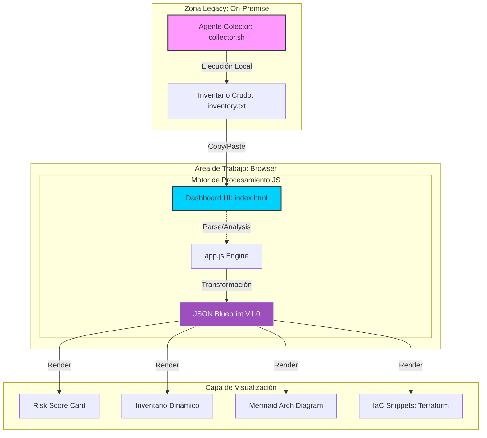

# Arquitectura Funcional: Modernization Factory V1.0

Este documento describe la arquitectura técnica del sistema construido para automatizar el descubrimiento y diseño de modernización cloud.

## Diagrama de Bloques (Flujo de Datos)

## Componentes Detallados

### 1. Agente Colector ([collector.sh](file:///c:/Users/hberrioe/Fabrica/collector.sh))
- **Tecnología**: Bash Script compatible con POSIX.
- **Responsabilidad**: Extracción forense de metadatos del OS, procesos activos, puertos escuchando y variables de entorno críticas sin dependencias externas.

### 2. Dashboard UI ([index.html](file:///c:/Users/hberrioe/Fabrica/index.html) + [styles.css](file:///c:/Users/hberrioe/Fabrica/styles.css))
- **Estética**: High-Fidelity Glassmorphism (Dark Mode).
- **Frontend**: HTML5 Semántico y CSS3 con sistema de diseño basado en tokens.
- **Interacción**: Responsive y animado para una experiencia premium.

### 3. Motor de Análisis ([app.js](file:///c:/Users/hberrioe/Fabrica/app.js))
- **Tipo**: Client-side Engine.
- **Responsabilidad**:
    - Sanitización del input crudo.
    - Simulación de análisis mediante patrones heurísticos (mapeo de RHEL 4, Java 1.4, etc.).
    - Generación de objetos JSON estructurados para alimentar los widgets de la UI.

### 4. Capa de Visualización (Libraries)
- **Mermaid.js**: Utilizado para renderizar dinámicamente el diagrama de la arquitectura *Target* (Amazon EKS / GKE).
- **Google Fonts (Outfit)**: Tipografía premium para legibilidad técnica.

---
> [!NOTE]
> Esta arquitectura está diseñada para ser **Zero-Infrastructure**; todo el procesamiento ocurre localmente en el navegador del arquitecto, garantizando la privacidad de los datos del servidor analizado.
