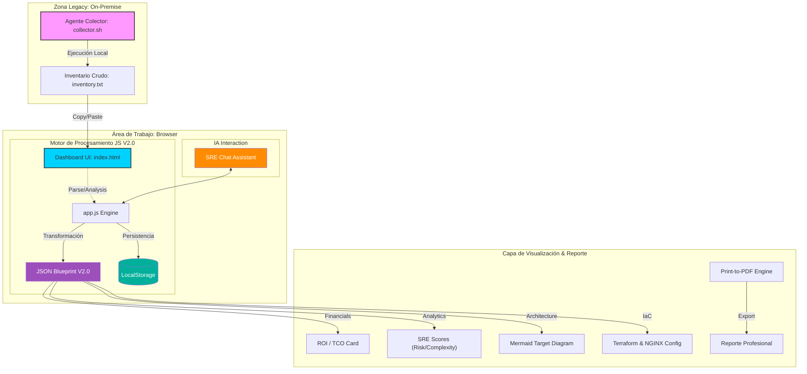

# Arquitectura Funcional: Modernization Factory V2.1 (SRE & Financial)

Este documento describe la arquitectura técnica del sistema construido para automatizar el descubrimiento y diseño de modernización cloud.

## Diagrama de Bloques (Flujo de Datos)

## Componentes Detallados

### 1. Agente Colector ([collector.sh](file:///c:/Users/hberrioe/Fabrica/collector.sh))
- **Responsabilidad**: Extracción forense de metadatos del OS, procesos activos y puertos escuchando en sistemas antiguos (RHEL 4+).

### 2. Dashboard UI & Export System
- **Estética**: High-Fidelity Glassmorphism.
- **Reporting**: Motor `@media print` optimizado para generar PDFs listos para entrega ejecutiva sin elementos de UI interactivos.

### 3. Motor de Análisis V2.0 ([app.js](file:///c:/Users/hberrioe/Fabrica/app.js))
- **Módulo Financiero**: Cálculo automático de OPEX Cloud, Costos de Migración y ROI (Cálculo de Payback basado en ahorro de mantenimiento).
- **Módulo SRE**: Puntuación de Complejidad Técnica y Readiness.
- **NGINX Logic**: Generación de configuraciones proxy-pass con soporte de sticky sessions.

### 4. SRE AI Assistant & Persistencia
- **Chat Assistant**: Interfaz interactiva para consultas técnicas sobre el análisis legacy.
- **LocalStorage**: Mantiene el estado del último análisis para evitar pérdida de datos en el navegador.

---
> [!NOTE]
> Esta arquitectura está diseñada para ser **Zero-Infrastructure**; todo el procesamiento ocurre localmente en el navegador del arquitecto, garantizando la privacidad de los datos del servidor analizado.
