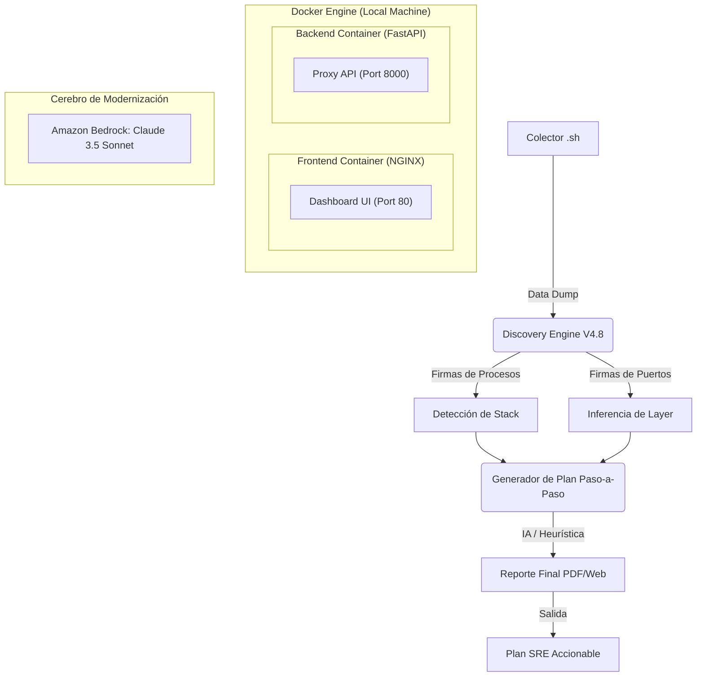

# Arquitectura: Modernization Factory V4.0 (Microservices & Docker)

Esta arquitectura describe el ecosistema de **Microservicios** orquestado mediante **Docker Compose**.

## Diagrama de Orquestación Docker

## Beneficios
*   **Cero Sesgo**: No requiere que el usuario declare las tecnologías.
*   **Predictibilidad**: Planes numerados listos para ser incorporados a JIRA o n8n.
*   **Portabilidad Extrema**: Funciona en laptops aisladas sin dependencias externas.
