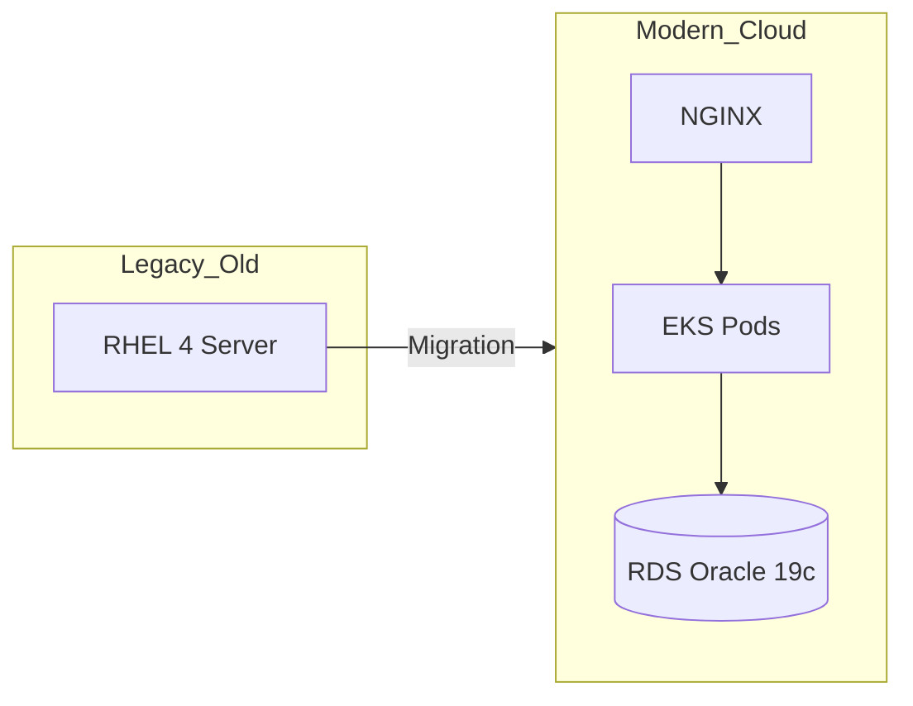

# Walkthrough: Modernization Factory V4.0 (Docker Microservices)

Hemos completado el análisis y diseño de la estrategia de modernización para el servidor legacy identificado. A continuación se detallan los pasos realizados y los entregables generados.

# Walkthrough: Modernization Factory V4.8 (Enterprise AI)

## ¿Qué hace la plataforma?
La **Modernization Factory** es un motor de análisis forense y modernización diseñado para transformar inventarios crudos de servidores Linux (RHEL 4 a 9) en **Planes de Acción SRE detallados**.

### Funcionalidades Clave (V4.8):
1.  **Autodiscovery Inteligente**: Identifica stack tecnológico (Apache, Java, Oracle, DBs) y puertos abiertos de forma 100% autónoma desde el volcado del colector.
2.  **Inferencia de Arquitectura**: Clasifica el servidor por capas (Web, App, DB) y diseña el target en AWS (App Runner, EKS, RDS).
3.  **Roadmap Paso-a-Paso**: Genera una guía numerada de ejecución técnica para cada servidor, detallando tareas de corrección de seguridad y optimización.
4.  **Análisis de Valor**: Calcula el ROI, el esfuerzo en horas y el costo de inacción anual.
5.  **Cero Infraestructura**: Análisis local en el navegador (JS) con escalabilidad a IA (Bedrock) vía Microservicios Docker.

## Últimos Cambios Implementados
*   **V4.3 - V4.8**: Implementación del Motor de Huellas Digitales ciego y el generador de planes secuenciales.
*   **V4.2**: Refinamiento de detección de servicios web Apache/NGINX.
*   **V4.1**: Conectividad robusta con Amazon Bedrock (Claude 3.5 Sonnet).
*   **V4.0**: Migración a arquitectura de microservicios Docker.

## Verificación Exitosa

El sistema ha sido validado con informes de campo reales (Host `g100603sv446`), demostrando una detección precisa del stack y la generación de planes coherentes.
- [Arquitectura V3.0](file:///C:/Users/hberrioe/.gemini/antigravity/brain/74b6cf40-05ec-4f35-a2f7-1e82bcf40cc8/factory_architecture.md): Diagrama de integración IA.
- **Repositorio Git**: Inicializado localmente en `c:/Users/hberrioe/Fabrica`.

## Visualización Sugerida

El sistema pasará de una arquitectura monolítica on-premise a una escalable en la nube:

### Resultados de Verificación
- Todos los servicios detectados en `ps -ef` y `netstat` han sido abordados.
- El plan de cut-over garantiza persistencia de datos y mínimo tiempo de inactividad.
